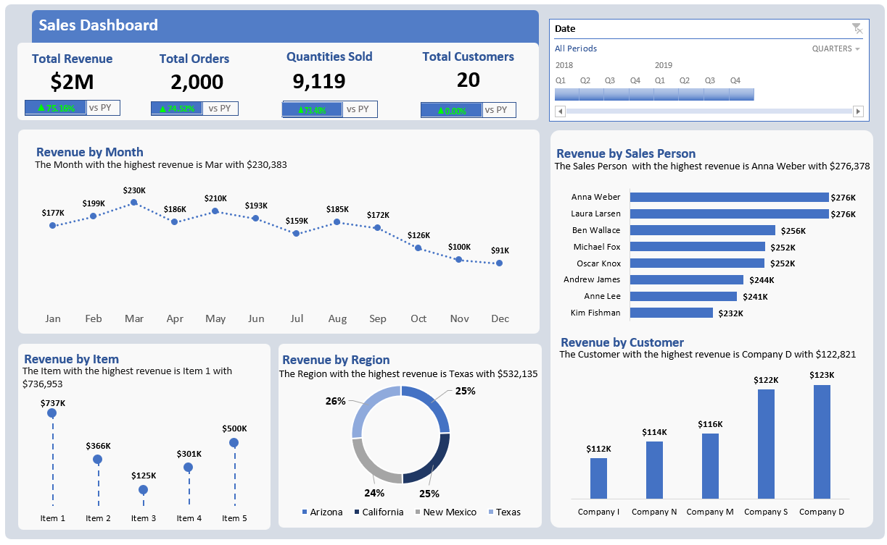

# Excel-Sales-Dashoard

## Project Overview
This project is a Sales Performance Dashboard built using Power BI to analyze revenue, orders, customer distribution, and regional performance.
## Tools Used
* Excel
  - Pivot Tables
  - Calculated Measures
  - Excel Functions
* Power Point
  -Wireframe
  ## Exploratory Data Analysis
- Revenue trend analysis
- Salesperson performance breakdown
- Customer revenue contribution
- Regional sales distribution
- Product-level performance

## Data Analysis
### Excel Measures
- Total Revenue
```Excel
 =SUM([Revenue])
```
- Total Revenue
```Excel
=CALCULATE([Total Revenue],SAMEPERIODLASTYEAR('Calendar'[Date]))
```

- YOY Revenue
```Excel
=var pyrevenue=[PY revenue]
 var currevenue=[Total Revenue]
 return 
 if(not ISBLANK(([PY revenue])),
 DIVIDE(currevenue-pyrevenue,pyrevenue),0)
```
- Total Customers
```Excel
=DISTINCTCOUNT([Customer ID])
```
- Total Revenue
```Excel
 =SUM([Revenue])
```
### Excel Functions
* INDEX/MATCH
  - Subtitle Text
```Excel
 ="The Month with the highest revenue is "&INDEX(H8:H19,MATCH(MAX(I8:I19),I8:I19,0))& " with "&TEXT(MAX(I8:I19),"$#,##")
```

## Key Insights
- Total Revenue: $2M
- Highest Revenue Month: March ($230K)
- Top Salesperson: Anna Weber ($276K)
- Best Region: Texas ($532K)

## Dashboard

